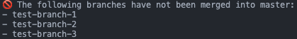

# git-unmerge-branches

<p>
  <a href="https://www.npmjs.com/package/git-unmerge-branches">
    
  </a>
  <a href="https://github.com/yyz945947732/git-unmerge-branches/pulls">
    
  </a>
  <a href="/LICENSE.md">
    
  </a>
</p>

> list all local Git branches that have **not been merged** into the base branch (default master).



## Install

```bash
npm install --global git-unmerge-branches
```

## Usage

```bash
npx unmerge-branches [options]
```

### Options

```bash
-h, --help              Show help information
-v, --version           Show the current version
-b, --base <branch>     Specify the base branch (default: master)
```

### Examples

```bash
# List branches not merged into 'master'
npx unmerge-branches

# List branches not merged into 'main'
npx unmerge-branches --base main
```

## LICENSE

[MIT](https://github.com/yyz945947732/git-unmerge-branches/blob/master/LICENSE)

---

This project is created using [generator-stupid-cli](https://github.com/yyz945947732/generator-stupid-cli).
